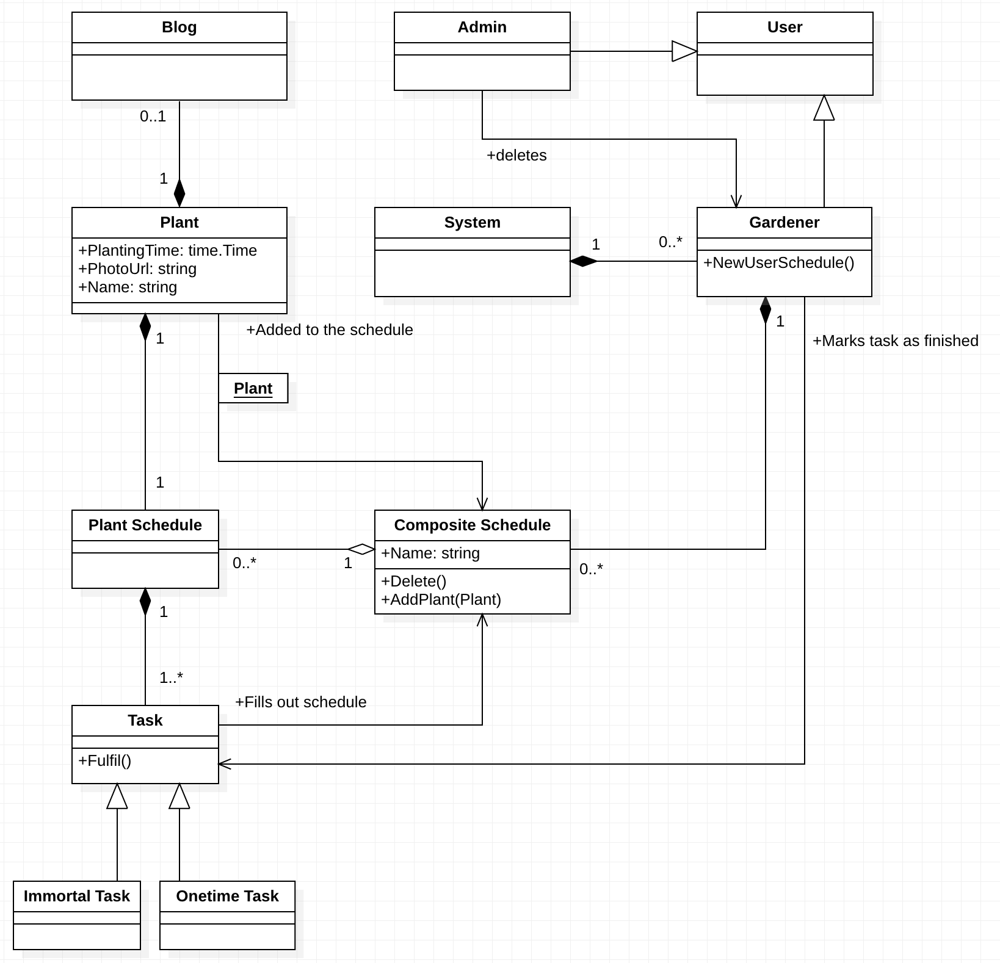

=======

>>>>>>> origin/license-link

# Plantbook, plants social network.

## Contents

1. [Introduction](#introduction)
2. [Components](#components)
3. [Main classes](#main-classes)

<a id=introduction>

## 1. Introduction

Plantbook is an online service that intended for the plant owners and gardeners who look for a tool that would allow
them to take care about their plants better. Every plant can optionally have a name and eventually a blog about
its life, that can contain photos, some sad or happy stories.

<a id=components>

## 2. Components

<a id=main-classes>

## 3. Main classes

