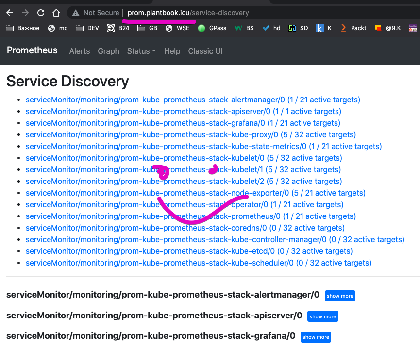
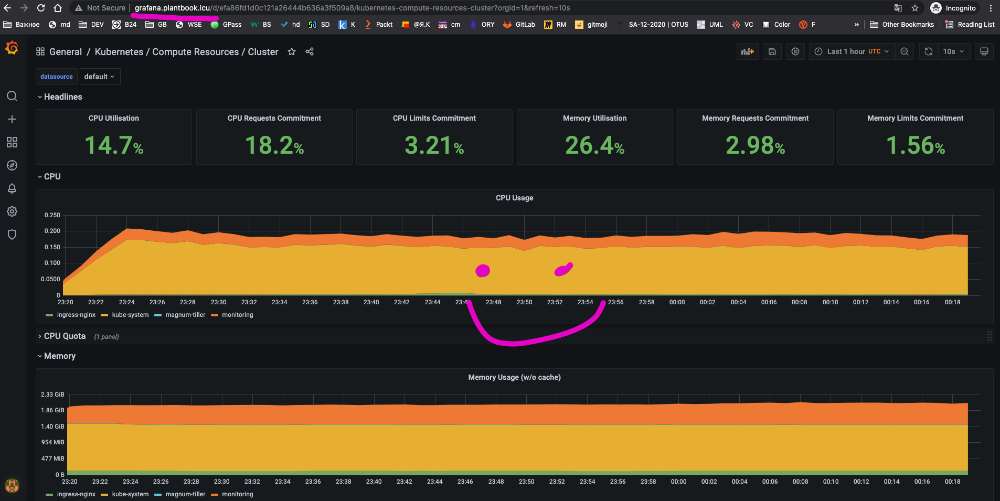
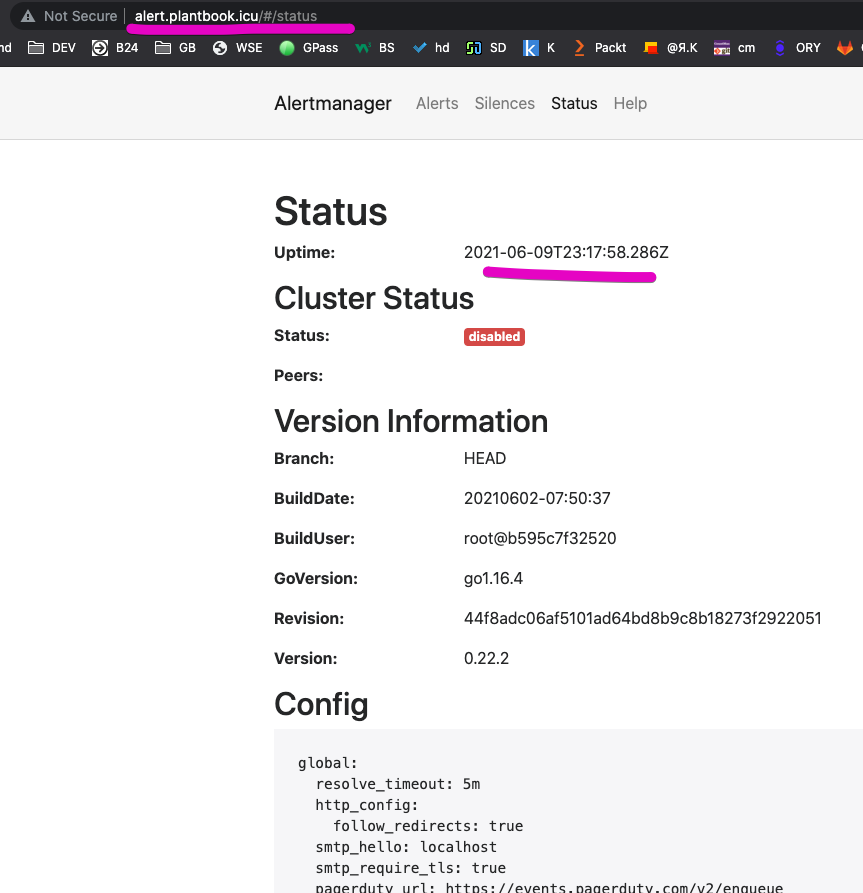

# Подготовка чистого кластера к использованию в проекте plantbook

@2021-06-09 by @art-frela

## План кратко

- Создание namespace-ов и service-account-ов
- Создание kubeconfig-ов для соответствующих service-account-ов
- Установка мониторинга в namespace-e monitoring
- Создание servicemonitor-ов (тестовый и plantbook)
- Проверка доступа к вэб интерфесам прометея и графаны

## План по шагам

### Создание namespace-ов и service-account-ов

Создаем k8s манифест для создание namespace-ов и service-account-ов с привязкой их к ролям с правами на все действия в их namespace-e:

<details>
<summary>manifests/sa.yaml</summary>
<p>

```yaml
---
apiVersion: v1
kind: Namespace
metadata:
  name: plantbook-test
---
apiVersion: v1
kind: Namespace
metadata:
  name: plantbook-prod
---
apiVersion: v1
kind: ServiceAccount
metadata:
  name: plantbook-test
  namespace: plantbook-test
---
apiVersion: v1
kind: ServiceAccount
metadata:
  name: plantbook-prod
  namespace: plantbook-prod
---
apiVersion: rbac.authorization.k8s.io/v1
kind: Role
metadata:
  name: plantbook-test-full-access
  namespace: plantbook-test
rules:
- apiGroups: ["", "extensions", "apps", "networking.k8s.io"]
  resources: ["*"]
  verbs: ["*"]
- apiGroups: ["batch"]
  resources:
  - jobs
  - cronjobs
  verbs: ["*"]
---
apiVersion: rbac.authorization.k8s.io/v1
kind: RoleBinding
metadata:
  name: plantbook-test-user-view
  namespace: plantbook-test
subjects:
- kind: ServiceAccount
  name: plantbook-test
  namespace: plantbook-test
roleRef:
  apiGroup: rbac.authorization.k8s.io
  kind: Role
  name: plantbook-test-full-access
---
apiVersion: rbac.authorization.k8s.io/v1
kind: Role
metadata:
  name: plantbook-prod-full-access
  namespace: plantbook-prod
rules:
- apiGroups: ["", "extensions", "apps", "networking.k8s.io"]
  resources: ["*"]
  verbs: ["*"]
- apiGroups: ["batch"]
  resources:
  - jobs
  - cronjobs
  verbs: ["*"]
---
apiVersion: rbac.authorization.k8s.io/v1
kind: RoleBinding
metadata:
  name: plantbook-prod-user-view
  namespace: plantbook-prod
subjects:
- kind: ServiceAccount
  name: plantbook-prod
  namespace: plantbook-prod
roleRef:
  apiGroup: rbac.authorization.k8s.io
  kind: Role
  name: plantbook-prod-full-access
```

</p>
</details>

и применяем его

```bash
# перешли в папку deploy/k8s/prepare
cd deploy/k8s/prepare
# apply sa.yaml
kubectl apply -f manifests/sa.yaml                                                                                                                             ()
# namespace/plantbook-test created
# namespace/plantbook-prod created
# serviceaccount/plantbook-test created
# serviceaccount/plantbook-prod created
```

### Создание kubeconfig-ов для соответствующих service-account-ов

> [source script](https://github.com/zlabjp/kubernetes-scripts/blob/master/create-kubeconfig)

Создаем скрипт `kcfg.sh` в папке `deploy/k8s/prepare/scripts` содержимое как в источнике

```bash
# перешли в папку deploy/k8s/prepare если выходили
cd deploy/k8s/prepare
# делаем скрипт исполняемым
chmod +x scripts/kcfg.sh
# создаем kubeconfig для plantbook-test
./scripts/kcfg.sh plantbook-test -n plantbook-test
# вывод сохраняем в файл plantbook-test-k8s-conf.yaml
# создаем kubeconfig для plantbook-test
./scripts/kcfg.sh plantbook-prod -n plantbook-prod
# вывод сохраняем в файл plantbook-prod-k8s-conf.yaml
# проверяем, что есть доступ до своего namespace-a

```

полученный файлы переносим в google disk организации

!!!Надо проверить достаточно ли будет прав для деплоя

### Установка мониторинга в namespace-e monitoring при помощи helm

> Требуется иметь [установленный helm 3](https://helm.sh/docs/intro/install/).  
> Все действия выполняем под админом кластера

Создаем в папке `deploy/k8s/prepare/prometheus/` файл `prometheus.yaml` с кастомными значениями helm chart-a

```yaml
prometheus:
  prometheusSpec:
    serviceMonitorSelectorNilUsesHelmValues: false
    serviceMonitorSelector: {}
```

- Добавляем [prometheus-community helm repo](https://github.com/prometheus-community/helm-charts/tree/main/charts/kube-prometheus-stack)

```bash
helm repo add prometheus-community https://prometheus-community.github.io/helm-charts
helm repo update
```

- Устанавливаем prometheus в namespace `monitoring`

```bash
kubectl create namespace monitoring
# перешли в папку deploy/k8s/prepare если выходили
cd deploy/k8s/prepare
# называем релиз `prom` и указываем кастомный файл значений -f prometheus/prometheus.yaml
helm install prom prometheus-community/kube-prometheus-stack -f prometheus/prometheus.yaml -n monitoring
# NAME: prom
# LAST DEPLOYED: Thu Jun 10 02:16:25 2021
# NAMESPACE: monitoring
# STATUS: deployed
# REVISION: 1
# NOTES:
# kube-prometheus-stack has been installed. Check its status by running:
#   kubectl --namespace monitoring get pods -l "release=prom"

# Visit https://github.com/prometheus-operator/kube-prometheus for instructions on how to create & configure Alertmanager and Prometheus instances using the Operator.
```

- Добавляем ingress для вэб доступа (но кроме графаны все скорее всего закроем)

```bash
# добавляем ingress
kubectl apply -f manifests/ingress.yml -n monitoring
# http://prom.plantbook.icu/
# http://grafana.plantbook.icu/ admin/prom-operator
# http://alert.plantbook.icu/
```

### Создание servicemonitor-ов (тестовый и plantbook)

// TODO: чет не заработало c наскока, может сам сервис нужен!?

### Проверка доступа к вэб интерфесам прометея и графаны

> http://prom.plantbook.icu/



http://grafana.plantbook.icu/ admin/prom-operator



http://alert.plantbook.icu/


